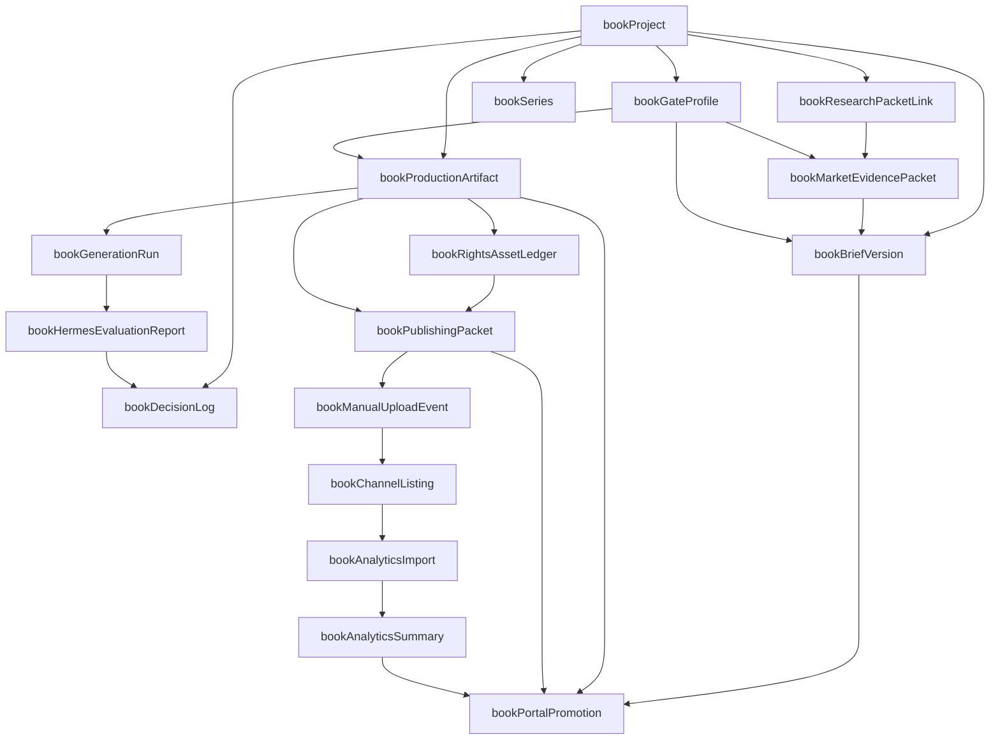

# Book Studio V1 Domain Record And State Model

**Date:** 2026-06-08
**Status:** Design-only conceptual model; not a Firestore schema, API contract, UI design, runtime build, or implementation plan.
**Authoritative dossier:** `docs/superpowers/specs/2026-06-07-book-studio-research-dossier.md`
**Decision packet:** `docs/superpowers/specs/2026-06-08-book-studio-v1-approval-packet.md`
**Workflow map:** `docs/superpowers/specs/2026-06-08-book-studio-v1-platform-workflow-map.md`
**Portal access model:** `docs/superpowers/specs/2026-06-08-book-studio-v1-portal-access-promotion-model.md`
**Publishing and analytics model:** `docs/superpowers/specs/2026-06-08-book-studio-v1-publishing-analytics-model.md`
**Market evidence model:** `docs/superpowers/specs/2026-06-08-book-studio-v1-market-evidence-model.md`
**Rights, asset, and contributor ledger model:** `docs/superpowers/specs/2026-06-08-book-studio-v1-rights-asset-contributor-ledger-model.md`

## Purpose

This model names the conceptual record families, relationships, states, and invariants that future Book Studio implementation planning must preserve if Peet approves the V1 record.

It exists to stop three common mistakes:

- Treating a polished book idea as a publishable book project before gates, rights, source freshness, and channel evidence exist.
- Treating client portal visibility as a mirror of admin state instead of a reviewed artifact promotion.
- Treating KDP, Google Play Books, analytics reports, Hermes output, and client approvals as one blended state instead of separate versioned decisions.

This file does not create runtime records, database collections, DTOs, route handlers, server actions, React components, Hermes skills, direct publishing integrations, analytics importers, or a Phase 1 task list.

## Boundary

The names below are conceptual. A later approved implementation plan may map them into Firestore documents, subcollections, view models, typed DTOs, or derived projections, but this document does not choose storage shape.

The future implementation should keep the concepts separable even if it stores some of them together for practical reasons.

## Record Family Map

| Record family | Conceptual job | Must connect to | Must not become |
| --- | --- | --- | --- |
| `bookProject` | The org-scoped book production workspace and lifecycle root. | Org, owner profile, book family, channel scope, current project state, linked Projects/Kanban items. | A single "generate book" prompt with no gates. |
| `bookGateProfile` | The derived mandatory gate set for the selected book family, formats, channels, ownership, and series posture. | Book family catalog, channel source keys, rights/provenance requirements, portal review rules. | A static checklist that ignores book type or channel. |
| `bookResearchPacketLink` | The bridge from Book Studio to PiB Research evidence. | Research item, source keys, confidence labels, unresolved claims, source refresh state. | A pasted research summary with no source lineage. |
| `bookMarketEvidencePacket` | The candidate-selection review packet that decides whether the idea can become production-selectable. | Research packet, gate profile, audience/buyer evidence, competitive shelf observations, metadata hypotheses, price/margin posture, channel fit, PiB fit, pass/warn/block decision. | A sales forecast, rank promise, automated market scrape, or competitor-copy record. |
| `bookBriefVersion` | A versioned product brief describing audience, promise, scope, assumptions, outline direction, channels, decisions, and success criteria. | Research packet, gate profile, client approval artifact when promoted. | A client approval request for unsupported claims. |
| `bookSeries` | Optional series scaffold covering volume order, continuity, shared metadata, and rollup rules. | Book projects, continuity notes, channel series warnings, analytics rollup shape. | A claim that future volumes or external series pages are approved. |
| `bookProductionArtifact` | Versioned manuscript, proof, package, cover, asset, and export artifacts. | File checksum, editorial checks, accessibility checks, rights ledger, package manifest. | A mutable file that keeps approval after content changes. |
| `bookGenerationRun` | Provenance ledger for AI-assisted or Hermes-assisted output. | Prompt intent, source inputs, model/tool context, output artifact, reviewer decision, disclosure implications. | Raw output that can be shown directly to clients. |
| `bookRightsAssetLedger` | Evidence ledger for images, cover assets, fonts, quotes, public-domain/open-license claims, AI assets, client-owned assets, contributor credit, assignment/license scope, territories, formats, channels, and artifact versions. | Production artifacts, publishing packets, blocker decisions, contributor metadata, portal-safe summaries, launch/lifecycle claims. | A generic "rights ok" checkbox, legal decision engine, contract generator, or global asset library. |
| `bookPublishingPacket` | Channel-specific manual-handoff readiness packet. | KDP packet, Google Play Books packet, metadata, files, disclosure, pricing, territories, source freshness, account authority. | A direct-publish command or credential store. |
| `bookChannelListing` | External listing status after human upload. | Channel, external IDs, live links, review state, revision requests, listing checksum or packet version. | Proof that PiB performed the upload. |
| `bookManualUploadEvent` | Evidence that a human operator uploaded or revised a package outside PiB. | Operator, timestamp, channel, packet version, external reference, uploaded files, review result. | An automated publishing integration. |
| `bookAnalyticsImport` | Manual import of KDP, Google, or later channel report data. | Source, period, timezone, report type, raw import reference, confidence, reconciliation state. | A blended revenue total. |
| `bookAnalyticsSummary` | Reviewed internal or client-safe analytics interpretation. | Imports, reconciliation notes, refunds/adjustments, cost attribution, confidence labels, series rollups. | A performance claim without source and confidence. |
| `bookHermesEvaluationReport` | Review record for Hermes skill output against the evaluation packet. | Skill key, fixture family, artifact, pass/warn/block verdict, sanitizer expectation, forbidden-action checks. | Runtime dispatch approval by itself. |
| `bookPortalPromotion` | Version-specific promotion of a safe artifact to the client portal. | Artifact version, safe DTO, promotion state, revoked/invalidated reason, client comments/approval. | A blanket permission to expose admin data. |
| `bookDecisionLog` | Immutable decision trail for approvals, waivers, blockers, revisions, and ownership/commercial choices. | User, timestamp, decision type, version, affected gate, rationale. | A hidden audit trail that only developers can understand. |

## Relationship Graph

## Project Lifecycle States

| State | Meaning | Exit condition |
| --- | --- | --- |
| `intake` | Admin is capturing the book idea, org, ownership posture, family, formats, channels, and client involvement. | Gate profile is derived. |
| `researching` | Market, channel, source, policy, rights, and category evidence is being gathered. | Research packet and market evidence packet are reviewable. |
| `market_review` | Candidate selection is pass/warn/block reviewed before Book Brief or production work. | Candidate is production-selectable, selectable with accepted warnings, or blocked/retired. |
| `brief_review` | Book Brief is being reviewed internally or through a promoted safe client version. | Brief version is approved or changes are requested. |
| `production` | Manuscript, proof, assets, series structure, and package work is active. | Current proof/package artifact is ready for review. |
| `proof_review` | Editorial, accessibility, rights, provenance, and package checks are being reviewed. | Proof/package version passes or is sent back. |
| `packet_review` | KDP and Google packet readiness is being checked separately. | Channel packet reaches approved manual-handoff state. |
| `manual_handoff_ready` | A human can upload from an approved packet, but PiB has not performed direct publishing. | Manual upload evidence is recorded. |
| `uploaded_external_review` | External store review, revision, or live status is being tracked. | Channel listing is live, revision-needed, or blocked. |
| `live` | At least one channel has evidence-backed live status. | Revision, analytics, or lifecycle action changes state. |
| `revision_needed` | Internal, client, or external channel changes are required. | Revised artifact or packet version re-enters review. |
| `paused` | Work is intentionally suspended. | Admin resumes or archives it. |
| `blocked` | Required evidence, rights, source freshness, account authority, or policy condition is missing. | Blocker is resolved or project is archived. |
| `archived` | Project is no longer active. | Only explicit admin restore can reopen it. |

## Artifact Promotion States

These states align with the portal access model and are always version-specific.

| State | Meaning |
| --- | --- |
| `internal_draft` | Artifact exists for PiB operators only. |
| `internal_review` | Artifact is ready for PiB review but not safe for client portal. |
| `client_review_ready` | A sanitized version can be promoted to the portal. |
| `client_changes_requested` | Client feedback exists and the current version is not approved. |
| `client_approved` | Client approved this exact artifact version. |
| `revoked` | Admin intentionally removed portal access to this artifact. |
| `invalidated` | A dependent change made the prior promotion or approval stale. |

## Publishing Packet States

KDP and Google Play Books packet states must stay separate because a pass on one channel does not imply a pass on the other.

| State | Meaning |
| --- | --- |
| `not_started` | No channel packet exists yet. |
| `draft` | Packet is being assembled. |
| `warning` | Non-blocking channel issue has owner, date, and next action. |
| `blocked` | Missing evidence prevents upload-readiness. |
| `internal_review` | Packet can be reviewed by PiB. |
| `approved_for_manual_handoff` | Human operator may upload from this packet version. |
| `external_uploaded` | Human upload evidence has been recorded. |
| `store_review` | External platform review is pending or in progress. |
| `store_changes_requested` | External platform requested changes. |
| `live` | External live evidence is recorded. |
| `superseded` | A newer packet version replaced this one. |

## Analytics States

Analytics must distinguish report import, interpretation, reconciliation, and portal promotion.

| State | Meaning |
| --- | --- |
| `not_imported` | No report data has been imported. |
| `imported_partial` | Report data exists but is incomplete, early, unmatched, or unreconciled. |
| `reconciliation_needed` | Refunds, adjustments, currency, ad costs, period mismatch, or source mismatch needs review. |
| `reviewed_internal` | PiB has reviewed the summary internally. |
| `client_summary_ready` | A confidence-labeled safe summary can be promoted. |
| `client_summary_promoted` | Client can see the promoted analytics summary. |
| `invalidated` | Later report evidence changed the summary. |

## Core Invariants

- Every record family is org-scoped. Cross-org reads are not valid even when an admin user can access multiple clients.
- Portal access is derived from explicit promotion records and safe DTOs, never from raw admin records.
- Client approval is bound to an exact artifact version and must not survive file, metadata, price, disclosure, rights, source, or packet changes.
- KDP and Google packet readiness are independent state machines.
- Source freshness is a blocking input for upload-readiness, not an optional note.
- Market evidence is a blocking input for Book Brief and production selection; it is not a sales forecast, rank promise, or bestseller claim.
- Hermes output is always artifact-linked, evaluation-linked, and reviewer-gated before it can influence a client-visible artifact.
- Account authority is recorded as a decision posture and evidence reference; sensitive channel credentials are not stored in Book Studio V1.
- Rights evidence is asset-specific, contributor-specific, license-scope-specific, channel-specific, territory-aware, and version-bound; it is not a project-wide boolean.
- Analytics summaries never blend estimated, reported, settled, refunded, adjusted, or attributed values without source, period, timezone, confidence, and reconciliation state.
- Portal module enablement controls visibility, but it does not override artifact safety or approval rules.
- A manual upload event records what a human did outside PiB; it does not imply direct publishing automation exists.
- Series rollups can summarize linked books only when each book's source, channel, and confidence state is visible.

## Invalidation Triggers

| Trigger | Invalidates |
| --- | --- |
| Source register item becomes stale or disputed. | Research packet, market evidence packet, Book Brief claims, publishing packet readiness, portal summaries that rely on the source. |
| Candidate audience, buyer use case, competitor observation, category/genre, keyword, price, margin, or channel-fit evidence changes. | Market evidence decision, Book Brief approval, and affected production-selection state. |
| Manuscript, cover, proof, EPUB, PDF, asset, or package checksum changes. | Proof approval, package approval, channel packet readiness, client approval for the old version. |
| Book promise, audience, title, subtitle, category, keyword, or description changes. | Book Brief approval and affected publishing metadata checks. |
| Rights, public-domain, open-license, quote, image, font, template, client-owned asset, contributor assignment, AI asset, territory, format, or channel evidence changes. | Rights approval, production-start eligibility, proof approval, package QA, packet readiness, portal claims, launch copy, and analytics summaries that depend on the claim. |
| Account authority, ownership, territory, price, royalty, or commercial model changes. | Upload-readiness, client commercial approval, analytics interpretation. |
| AI disclosure answer changes. | Publishing packet readiness and affected channel listing notes. |
| Store review requests a change. | Channel listing state, package version, affected portal live-status summary. |
| New analytics import, refund, adjustment, payment, ad cost, currency correction, or unmatched row appears. | Analytics summary confidence and any promoted client summary. |
| Hermes evaluation returns warning or block for an output used by an artifact. | Artifact promotion state until reviewer resolves it. |

## Future Test Obligations

If Peet approves the V1 record and implementation planning starts, the first plan should include tests that prove:

- Missing or disabled portal module access cannot reveal Book Studio artifacts.
- Org A cannot access Org B book projects, packet states, upload evidence, analytics imports, or portal promotions.
- A changed file checksum invalidates proof, packet, and client approval states.
- KDP packet approval does not mark Google Play Books approved, and the reverse.
- A stale source blocks upload-readiness.
- Missing or blocked market evidence prevents Book Brief promotion and production selection.
- Market evidence cannot store rank promises, sales forecasts, copied competitor metadata, or automated scrape results as proof.
- Raw Hermes output, internal notes, rights uncertainty, parser errors, account details, and unreconciled costs cannot appear in portal DTOs.
- Assets, quotes, fonts, templates, public-domain/open-licensed material, AI-generated assets, client-owned brand assets, and contributor inputs cannot advance dependent production, package, portal, launch, analytics, or handoff states without a rights-ledger pass or accepted-warning state.
- Partial analytics imports stay warning-labeled until reconciliation is complete.
- Client approval can only apply to promoted artifact versions.
- A manual upload event can update external status without storing store credentials or pretending PiB published directly.

## Devil's Advocate

- A domain model can become fake certainty if it is treated as schema. This file names product concepts; it does not decide storage, indexes, routes, or implementation order.
- Too many record families can overcomplicate V1. The later implementation should consolidate storage where practical while preserving these invariants.
- Too few states will create dangerous shortcuts: "ready", "approved", and "live" are not enough for books because rights, channel rules, file versions, and analytics all move independently.
- Portal promotion is the easiest place to leak internal uncertainty. The model therefore treats client visibility as a separate versioned record, not as a field on the artifact.
- Manual upload evidence may feel unsatisfying compared with direct publishing, but it protects V1 from credential custody, platform policy drift, and irreversible store actions before the operating model is proven.

## Current Review State

This model supports the existing V1 approval gate. It adds implementation-planning guardrails for domain concepts and state transitions, but it does not authorize implementation work.

The next product decision remains Peet approving, revising, rejecting, or requesting more design detail on the Book Studio V1 approval record.
