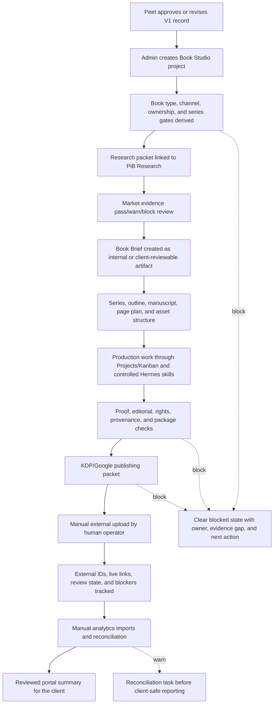
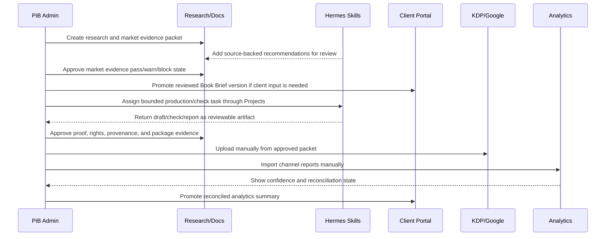

# Book Studio V1 Platform Workflow Map

**Date:** 2026-06-08
**Status:** Design-only workflow map; not an implementation plan.
**Authoritative dossier:** `docs/superpowers/specs/2026-06-07-book-studio-research-dossier.md`
**Decision packet:** `docs/superpowers/specs/2026-06-08-book-studio-v1-approval-packet.md`
**Acceptance fixtures:** `docs/superpowers/specs/2026-06-08-book-studio-v1-acceptance-fixtures.md`
**Portal access model:** `docs/superpowers/specs/2026-06-08-book-studio-v1-portal-access-promotion-model.md`
**Domain record/state model:** `docs/superpowers/specs/2026-06-08-book-studio-v1-domain-record-state-model.md`
**Operator workspace control model:** `docs/superpowers/specs/2026-06-08-book-studio-v1-operator-workspace-control-model.md`
**Market evidence model:** `docs/superpowers/specs/2026-06-08-book-studio-v1-market-evidence-model.md`

## Purpose

This map gives Peet a fast way to review how Book Studio V1 fits into Partners in Biz without reading the full dossier. It turns the long design into a platform flow: who sees what, where Hermes helps, where publishing handoff happens, and where analytics becomes client-safe.

This file does not approve runtime code, database collections, APIs, routes, components, direct publishing, Hermes runtime dispatch, or a Phase 1 implementation plan.

The companion domain record/state model names the conceptual records and state machines behind this workflow without choosing schema, route, or implementation order.

The companion operator workspace control model explains how future admins should navigate these stages through safe commands, blockers, and PiB surface bridges without making a blank-prompt-first Book Studio.

## V1 System Posture

Recommended V1 remains an internal PiB production studio with optional client review.

The system should feel like this:

- Admin owns intake, research, production, packet readiness, upload evidence, and analytics reconciliation.
- Hermes creates reviewable recommendations, drafts, checks, and tasks inside strict skill boundaries.
- Client portal sees only promoted artifact versions: Book Briefs, proofs, publishing packets, live status, safe blockers, and reconciled analytics summaries.
- External stores stay outside PiB automation in V1. Humans upload manually to KDP and Google Play Books from evidence-backed packets.
- Analytics begins with manual imports and confidence labels, not a single blended revenue chart.

## High-Level Platform Flow

## Surface Map

| Surface | Primary job | Must show | Must not show in V1 |
| --- | --- | --- | --- |
| Admin Book Studio | Operate book projects end to end. | Project state, gate profile, linked research, brief status, production tasks, packet readiness, upload evidence, analytics confidence. | Direct store publishing, raw client self-serve generation, or unchecked upload-ready labels. |
| Projects/Kanban | Turn book production into accountable work. | Human and Hermes tasks, owners, blockers, review gates, artifact links. | Route-local prompt execution that bypasses task review. |
| Research | Hold source-backed market, category, rights, and policy evidence. | Findings, market evidence packets, source keys, confidence, unresolved claims, internal notes. | Client-visible legal conclusions, unsupported market promises, sales forecasts, rank promises, or copied competitor positioning. |
| Client Documents | Promote reviewed Book Briefs, proofs, packet summaries, and analytics summaries. | Versioned approval artifacts and comment/review state. | Raw Hermes output, internal rights notes, parser errors, or upload-account details. |
| Portal Book Studio | Let clients review safe artifacts when the module is enabled. | Reviewed briefs, selected proofs, packet summaries, live status, safe blockers, confidence-labeled analytics. | Any unreviewed internal production data. |
| Hermes skills | Produce bounded reviewable assistance. | Recommendations, drafts, checks, reports, and task suggestions with evidence contracts. | Publishing, spending, client messaging, credential requests, or approval bypasses. |
| External stores | Remain manual handoff destinations in V1. | KDP and Google upload evidence tracked back in PiB. | API publishing or credential custody. |

## Lane Responsibilities

## Gate Map

| Gate | Pass state | Warning state | Block state |
| --- | --- | --- | --- |
| V1 approval | Explicit approval record exists. | One field is revised and reflected in packet/dossier. | "Start building" is requested without posture, channel, pilot, portal, Hermes, and deferral choices. |
| Intake | Book family, formats, channels, owner, series posture, and client involvement derive mandatory gates. | Optional gate has owner/date/waiver path. | Drafting begins from a blank prompt without a gate profile. |
| Research | Source-backed findings and confidence labels exist. | Non-blocking claims need stronger evidence before launch. | Unsupported or internal-only claims are promoted to a client brief. |
| Market evidence | Candidate has reviewed audience/buyer, competitive shelf, discoverability, rights, channel, price/margin, PiB fit, and capacity evidence. | Candidate is selectable with named evidence warnings, owner, and review date. | Book Brief or production starts from shelf screenshots, rank/sales promises, copied competitor positioning, misleading metadata, or unknown/negative margin. |
| Hermes | Skill output is bounded, reviewable, and artifact-linked. | Runtime dispatch remains disabled while fixtures mature. | Skill can publish, spend, message clients, ask for secrets, or mark client-ready. |
| Production proof | Manuscript, assets, rights, provenance, checks, and package version are bound to the current artifact. | Package is internally reviewable but not upload-ready. | File changes after approval without invalidating proof or packet state. |
| Publishing packet | KDP/Google packet has files, metadata, disclosure, pricing, rights, account authority, source freshness, and upload instructions. | One channel-specific warning has owner/date/waiver path. | Upload-ready state appears while evidence is missing or stale. |
| Manual upload | Human upload evidence, external IDs, and store review state are recorded. | Store review asks for changes and creates a revision task. | PiB performs direct upload or stores sensitive channel credentials. |
| Analytics | Source, period, timezone, confidence, reconciliation, refunds, adjustments, and unmatched rows are visible. | Partial data is useful but clearly labeled. | Estimates, reports, settlements, refunds, and ad attribution are merged into one unqualified total. |
| Portal promotion | Only reviewed artifact versions are visible. | Safe artifact lacks optional context but does not expose internal uncertainty. | Portal exposes raw research, raw Hermes output, internal rights notes, parser errors, or unreconciled costs. |

## First Review Walkthrough

Peet should be able to review V1 through this sequence:

1. Approve or revise the V1 approval record.
2. Open an example business nonfiction or activity/low-content project.
3. Confirm the derived book-family and channel gates appear before drafting.
4. Link or create a Research packet and reviewed market evidence packet.
5. Create a Book Brief only after the candidate is pass or accepted-warning.
6. See one Hermes recommendation become a reviewable artifact or task.
7. See one blocker, ideally the public-domain/companion negative-control fixture.
8. See a KDP/Google packet marked manual-handoff ready only after evidence is present.
9. See upload evidence recorded after human upload.
10. See analytics imported with confidence labels and reconciliation state before portal promotion.

## Decisions This Map Does Not Make

- It does not choose a UI layout.
- It does not define database fields or route names.
- It does not map conceptual record families into Firestore collections or DTOs.
- It does not define implemented admin commands, tabs, or components.
- It does not define a Phase 1 task order.
- It does not approve runtime Hermes dispatch.
- It does not approve client self-serve generation.
- It does not approve direct publishing or credential custody.

## Devil's Advocate

- A workflow map can make the system feel more build-ready than it is. It is only build-ready after Peet approves the V1 record and a separate Phase 1 plan is written.
- If the first screen is generation, the module will optimize for impressive demos instead of publishable evidence.
- If the first screen is only compliance, operators will avoid the module. Every gate needs a clear next useful action.
- If portal review is treated as a mirror of admin state, Book Studio will leak uncertainty instead of giving clients controlled approvals.
- If manual upload is treated as a temporary inconvenience, the team may overbuild direct publishing before account governance, rights, and packet evidence are proven.
- If analytics is framed as revenue too early, clients will make decisions from numbers that can later change through refunds, report lag, currency conversion, or settlement timing.

## Current Review State

This workflow map supports the same next decision as the approval packet:

- Approve the recommended V1 record.
- Approve it with field-level revisions.
- Reject the internal production-studio posture.
- Request another design-only aid.

Until that decision is made, Book Studio remains design/research complete for review, but not approved for implementation planning or runtime build work.
