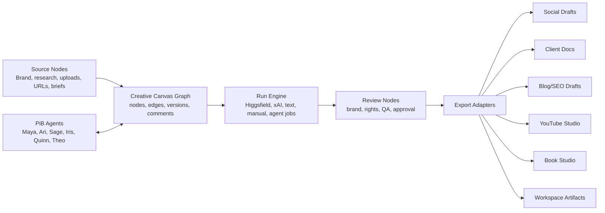

# PiB Creative Canvas Design Spec

**Status:** approved product direction, written spec for review.
**Date:** 2026-06-19.
**Owner:** Pip.
**Product area:** Partners in Biz portal, admin workspace, AI agents, Higgsfield, content production, social, blogs, videos, books, documents.

## Purpose

Partners in Biz needs a Higgsfield Canvas-class creative workspace inside the platform. The goal is not a single image-generation button or a social-only editor. The goal is a shared creation operating system where PiB operators, clients, and AI agents can plan, generate, edit, review, approve, and export creative work across social media, ads, blogs, videos, books, client documents, research, and campaign assets.

The approved direction is **Universal Canvas Foundation**.

This means V1 builds the common graph, run, provenance, review, and export foundation first. Social draft export is the first downstream adapter, but the architecture must be broad enough for Higgsfield-style image/video workflows, Book Studio artifacts, YouTube Studio render jobs, SEO/blog packages, and client document blocks without redesign.

## Product Position

PiB Creative Canvas becomes the creation orchestration layer. Existing modules remain the operational source of truth:

- Social posts remain in `social_posts`.
- Campaigns remain in `campaigns`.
- Client documents remain in `client_documents`.
- Research remains in `research_items`.
- YouTube production remains in YouTube Studio records.
- Book production remains in Book Studio records.
- Long-lived files and Drive links remain in workspace artifacts.

The canvas owns the creative graph, run intent, generation history, asset provenance, review state, and export decisions. It links to existing records instead of replacing them.

## Current Platform Evidence

The app already has strong primitives that should be reused:

- Social media APIs for AI text, image generation, media upload, account selection, scheduling, approval, and publishing.
- Campaign asset rollups that already group social, SEO/blog, and video assets.
- Client Documents with structured blocks, versions, comments, suggestions, approvals, and client-safe sharing.
- Research workspace for source-backed evidence and recommendations.
- YouTube Studio records for source assets, agent jobs, production drafts, render jobs, publish packets, and analytics.
- Book Studio records for projects, briefs, series, artifact links, publishing packets, rights ledgers, package manifests, analytics imports, and decision logs.
- Workspace artifacts for Google Drive and file links with tenant visibility, lifecycle state, approval gates, agent ownership, and permissions metadata.
- Agent routing, skill policy, and Hermes task execution patterns.
- Higgsfield runtime skills are already cataloged for the managed agent profiles.

The missing layer is a visual graph that can coordinate all of these pieces.

## Higgsfield Capability Target

PiB Creative Canvas should match the class of workflow offered by Higgsfield Canvas:

- Node-based visual composition.
- Prompt, image, reference, model, motion, and render nodes.
- Multi-model routing in one graph.
- Outputs chained between nodes.
- Team collaboration and saved versions.
- Image, video, product placement, style transfer, VFX, branding, campaign, and animation workflows.

PiB adds platform-specific requirements:

- Tenant scoping for every node, run, asset, and export.
- Agent-readable graph context.
- Approval gates before client-visible exposure, scheduling, publishing, sharing, ad launch, or destructive changes.
- Provider, model, cost, prompt, source, and synthetic-media provenance.
- Export adapters into PiB modules.

## Architecture



Core modules:

- `lib/creative-canvas/types.ts` defines the canonical graph, node, edge, run, export, provider, and provenance types.
- `lib/creative-canvas/store.ts` owns Firestore read/write helpers with org scoping, actor metadata, graph versioning, and sanitization.
- `lib/creative-canvas/providers.ts` owns the provider registry for Higgsfield, xAI, manual upload, text/document generation, and future media providers.
- `lib/creative-canvas/agent-bridge.ts` converts canvas run requests into reviewable internal agent tasks or agent jobs without bypassing approval gates.
- `lib/creative-canvas/exporters/*` maps reviewed canvas outputs into Social, Campaigns, Documents, Research, YouTube Studio, Book Studio, and workspace artifacts.
- `components/creative-canvas/*` contains the graph UI, node palette, inspector, run panel, review panel, and export panel.
- `app/api/v1/creative-canvas/*` exposes canvas CRUD, graph save, run request, output attachment, review updates, and export actions.

## UI Surfaces

### Portal Creative Canvas

Route: `/portal/creative-canvas`.

Purpose: client-safe creative workspace when the module is enabled for an organisation.

V1 capabilities:

- Create or open canvases for the selected workspace.
- Add source, prompt, brief, review, and output nodes.
- Upload or link source assets.
- Comment on nodes.
- View generated outputs that have been marked client-visible.
- Approve or request changes where the organisation policy allows it.

V1 restrictions:

- Clients cannot directly run arbitrary expensive providers.
- Clients cannot publish, schedule, share, launch ads, or override approval gates.
- Clients cannot see internal prompts, raw agent output, cost internals, or unsafe review notes unless explicitly promoted.

### Admin Creative Canvas

Route: `/admin/creative-canvas`.

Purpose: PiB operator and agent command workspace.

V1 capabilities:

- Full canvas creation and graph editing.
- Run internal generation jobs.
- Route nodes to agents.
- Review provenance, cost, risk, and rights status.
- Export reviewed outputs to downstream modules.
- Inspect run failures and retry safe jobs.

### Embedded Canvas Entry Points

Later routes should open or create a canvas from the module where work starts:

- Social composer: create from post/campaign context.
- Campaign detail: create a campaign creative pack canvas.
- Research detail: create from source-backed evidence.
- Client document editor: create or attach visual/document blocks.
- YouTube Studio: create from channel, video project, source asset, or render job.
- Book Studio: create from book brief, rights ledger, or package manifest.

## Graph Model

The graph is stored as canvases, nodes, edges, runs, and exports.

```ts
type CreativeCanvasStatus =
  | 'draft'
  | 'internal_review'
  | 'client_review'
  | 'approved'
  | 'archived'

type CreativeCanvasNodeType =
  | 'source'
  | 'brief'
  | 'prompt'
  | 'model'
  | 'edit'
  | 'review'
  | 'output'

type CreativeCanvasSourceKind =
  | 'brand_kit'
  | 'upload'
  | 'url'
  | 'research_item'
  | 'client_document'
  | 'campaign'
  | 'social_post'
  | 'youtube_asset'
  | 'book_studio_record'
  | 'workspace_artifact'

type CreativeCanvasProviderKey =
  | 'higgsfield'
  | 'xai'
  | 'manual_upload'
  | 'text_generation'
  | 'document_generation'
  | 'agent_task'

type CreativeCanvasOutputKind =
  | 'image'
  | 'video'
  | 'audio'
  | 'caption'
  | 'copy'
  | 'blog_draft'
  | 'document_block'
  | 'book_artifact'
  | 'youtube_render'
  | 'campaign_asset'
  | 'social_post_draft'

interface CreativeCanvas {
  id: string
  orgId: string
  title: string
  status: CreativeCanvasStatus
  purpose: string
  linked: {
    projectId?: string
    taskId?: string
    campaignId?: string
    researchItemId?: string
    clientDocumentId?: string
    socialPostId?: string
    youtubeVideoProjectId?: string
    bookStudioProjectId?: string
    workspaceArtifactIds?: string[]
  }
  activeVersion: number
  visibility: 'admin_agents' | 'admin_agents_clients'
  createdAt: unknown
  createdBy: string
  createdByType: 'user' | 'agent' | 'system'
  updatedAt: unknown
  updatedBy: string
  updatedByType: 'user' | 'agent' | 'system'
  deleted: boolean
}

interface CreativeCanvasNode {
  id: string
  canvasId: string
  orgId: string
  type: CreativeCanvasNodeType
  title: string
  position: { x: number; y: number }
  size?: { width: number; height: number }
  data: Record<string, unknown>
  source?: {
    kind: CreativeCanvasSourceKind
    refId?: string
    url?: string
    mimeType?: string
  }
  provider?: {
    key: CreativeCanvasProviderKey
    model?: string
    mode?: string
  }
  review?: {
    status: 'not_required' | 'needed' | 'passed' | 'warning' | 'blocked'
    approvalGateTaskId?: string
    requiredReviewerAgentId?: string
    syntheticMediaDisclosure?: boolean
    rightsStatus?: 'unknown' | 'cleared' | 'needs_review' | 'blocked'
    brandStatus?: 'unknown' | 'passed' | 'needs_review' | 'blocked'
  }
  output?: {
    kind: CreativeCanvasOutputKind
    artifactId?: string
    url?: string
    thumbnailUrl?: string
    storagePath?: string
    textPreview?: string
  }
  createdAt: unknown
  updatedAt: unknown
}

interface CreativeCanvasEdge {
  id: string
  canvasId: string
  orgId: string
  sourceNodeId: string
  targetNodeId: string
  label?: string
  data?: Record<string, unknown>
}
```

## Run Model

Runs represent provider calls, manual generation records, and agent work.

```ts
type CreativeCanvasRunStatus =
  | 'queued'
  | 'running'
  | 'waiting_for_review'
  | 'completed'
  | 'failed'
  | 'cancelled'

interface CreativeCanvasRun {
  id: string
  orgId: string
  canvasId: string
  nodeId: string
  providerKey: CreativeCanvasProviderKey
  model?: string
  status: CreativeCanvasRunStatus
  input: {
    promptSummary?: string
    sourceNodeIds: string[]
    sourceArtifactIds: string[]
    format?: string
    aspectRatio?: string
    durationSeconds?: number
  }
  output?: {
    outputNodeId?: string
    artifactId?: string
    url?: string
    thumbnailUrl?: string
    textPreview?: string
    rawProviderJobId?: string
  }
  provenance: {
    generatedBy: 'user' | 'agent' | 'provider' | 'system'
    agentId?: string
    providerJobId?: string
    model?: string
    costUnits?: number
    costLabel?: string
    promptStored: 'none' | 'summary' | 'full_internal'
    syntheticMedia: boolean
  }
  error?: {
    code: string
    message: string
    retryable: boolean
  }
  createdAt: unknown
  updatedAt: unknown
}
```

Run execution rules:

- Direct provider calls are allowed only for providers with configured server-side credentials and cost controls.
- Higgsfield CLI/MCP usage is treated as credit-metered unless Higgsfield explicitly confirms otherwise.
- Web-only Higgsfield promo/unlimited benefits should be represented as manual or assisted workflow steps, not silently assumed available through CLI.
- Expensive, risky, or agent-owned jobs should create reviewable agent tasks or jobs rather than blocking a request thread.
- Raw provider outputs remain internal until sanitized and reviewed.

## Provider Registry

The provider registry defines what each provider can do and what gate it requires.

Provider capabilities:

- `generate_image`
- `edit_image`
- `generate_video`
- `edit_video`
- `generate_copy`
- `generate_caption`
- `generate_document_block`
- `analyze_media`
- `create_variants`

Provider metadata:

- Supported input kinds.
- Supported output kinds.
- Supported aspect ratios and durations.
- Whether it is synchronous or async.
- Whether it uses external credits.
- Risk level.
- Required approval before client visibility.
- Required disclosure fields.
- Owning agent.

V1 providers:

- `manual_upload`: attach a user-uploaded or existing workspace artifact.
- `xai`: reuse the existing internal image generation path where safe.
- `higgsfield`: create Higgsfield-ready run records and route actual execution through the approved runtime or agent bridge.
- `agent_task`: dispatch reviewable agent work for prompt refinement, creative direction, QA, or module-specific production.

## Agent Integration

Agents are first-class canvas collaborators.

Agent responsibilities:

- **Pip:** routing, approvals, module linking, owner/operator summaries.
- **Maya:** social/content creative, Higgsfield image/video prompts, campaign packs.
- **Ari:** paid-media concepts, ad variants, platform fit, budget/spend gates.
- **Sage:** research-backed source nodes, competitor and audience intelligence.
- **Iris:** document blocks, reports, proposals, client-safe packaging.
- **Quinn:** QA, release readiness, visual checks, disclosure and approval gates.
- **Theo:** implementation, provider plumbing, debugging, integrations.
- **Silas:** SEO/blog content, search intent, article packaging.
- **Vera:** analytics evidence and performance-derived next actions.
- **Nora:** operations, account readiness, billing/cost guardrails.

Agent bridge requirements:

- Agents can fetch the canvas, graph, run history, and linked artifacts through tenant-safe APIs.
- Agents can write back run summaries, output references, review notes, and proposed exports.
- Agents cannot directly publish, schedule, spend, share, expose to clients, or override approval gates.
- Every agent write stores `agentId`, source node ids, output refs, and safe summary.

## Export Adapters

V1 ships one production adapter and stubs contracts for later adapters.

### Social Draft Export

Creates a draft social post from reviewed output nodes.

Requirements:

- Requires org match.
- Requires output kind compatible with selected platforms.
- Requires review state not blocked.
- Requires synthetic-media flag where applicable.
- Creates draft only. Publishing and scheduling remain in existing Social approval paths.

### Later Adapters

- Campaign asset export: attach output to campaign assets and campaign preview.
- Blog/SEO export: create SEO content draft or blog package.
- Client document export: create image, gallery, video, rich-text, or approval blocks.
- Research export: attach outputs as evidence or recommendations.
- YouTube Studio export: create source asset, production draft, render job, or publish-packet input.
- Book Studio export: create artifact link, package manifest entry, cover/interior asset, or decision-log evidence.
- Workspace artifact export: register generated files and Drive links.

## Data Flow

1. User or agent creates a canvas inside an organisation.
2. Source nodes attach brand kit, uploads, URLs, research items, campaign briefs, book briefs, or existing artifacts.
3. Prompt/model nodes define what should be generated or transformed.
4. A run request creates a `creative_canvas_run` with provider, model, prompt summary, source refs, risk level, and expected output type.
5. The run executes through an internal provider path or a reviewable Hermes/agent task.
6. Output nodes store result URLs, storage refs, thumbnails, transcript/captions when present, provider metadata, and synthetic-media disclosure.
7. Review nodes record brand, rights, QA, approval, and client-visibility state.
8. Export adapters create downstream drafts only when gates allow it.

## Failure Handling

- Provider failure: run status becomes `failed`, node shows the error, no downstream export is allowed.
- Missing approval: export action is blocked with the exact gate needed.
- Tenant mismatch: source and output linking fails before write.
- Cost or credit limit: run is blocked before dispatch.
- Unsafe or unsupported claim: output remains internal and creates a review task.
- Partial graph save failure: graph version remains unchanged and the UI reloads the last saved version.
- Agent timeout: run remains `waiting_for_review` or `failed` with the task id and last heartbeat.
- Deleted linked source: node remains visible but marked stale so prior decisions stay auditable.

## Permissions And Governance

Sensitive actions are hard-gated:

- Public publishing.
- Social scheduling.
- Client-visible sharing.
- Paid ad launch or spend.
- External Drive sharing.
- Store upload or book publishing.
- YouTube publishing.
- Destructive deletes.
- Secret or credential changes.

Canvas V1 may create internal drafts and internal artifacts. It may not bypass existing approval routes in Social, Documents, YouTube Studio, Book Studio, or Ads.

## UI Design Principles

The canvas is a work surface, not a marketing page.

Layout:

- Full-screen workbench.
- Left node palette with grouped source, generation, edit, review, and output nodes.
- Center graph canvas.
- Right inspector for selected node, run, provenance, review, and export actions.
- Bottom or side run history panel.
- Compact top toolbar for canvas title, status, save state, org scope, and primary actions.

Controls:

- Use familiar icon buttons for zoom, fit, undo, redo, duplicate, delete, run, and export.
- Use tabs in the inspector for Configure, Input, Output, Review, and Exports.
- Use status pills for run and review state.
- Use swatches for brand colors and provider badges.
- Use menus for provider/model choice.
- Use toggles for synthetic-media disclosure and client-visible readiness.

V1 does not require real-time multi-user cursors, but the data model must support saved versions and comments.

## Release Plan

### V1: Universal Canvas Foundation

Scope:

- Install graph UI dependency.
- Add core types, sanitizers, store helpers, and API routes.
- Add admin and portal canvas routes.
- Create graph UI with node palette, inspector, save/reload, and run status.
- Add provider registry with manual, xAI, Higgsfield, and agent-task capabilities.
- Add Higgsfield-ready run records routed through internal review.
- Add social draft export.
- Add tests for graph validation, tenant safety, run creation, and export gates.

Acceptance:

- A user can create a canvas, add source/prompt/model/output nodes, connect them, and save/reload the graph.
- A Higgsfield-ready node can create a reviewable internal generation run without publishing or exposing it to clients.
- A completed run can attach an output asset to the canvas with provenance.
- A reviewed output can export to a Social draft.
- Agents can read canvas context and write back run results through approved internal APIs.
- No canvas route can publish, schedule, share, launch ads, expose client-visible assets, or perform destructive changes without approval.

### V2: Rich Media And Agent Loops

Scope:

- Higgsfield video/Soul workflows.
- Live agent run updates.
- Rich image/video previews.
- Campaign pack generation.
- Document and Research exports.
- Prompt/version comparison.
- Visual QA integration.

### V3: Full Production Studio

Scope:

- Book Studio exports.
- YouTube Studio exports.
- Multi-user collaboration.
- Version comparison and branching.
- Advanced timeline/video editing.
- Client review rooms.
- Provider cost dashboards.
- Reusable canvas templates.

## Testing Strategy

Unit tests:

- Type guards and sanitizers.
- Graph validation.
- Provider registry.
- Run state transitions.
- Export guards.
- Tenant checks.

API tests:

- Create/list/update canvas.
- Save graph.
- Create run.
- Attach output.
- Update review state.
- Block unsafe export.
- Export to Social draft.

UI tests:

- Create/open canvas.
- Add/connect nodes.
- Save/reload graph.
- Select node and edit inspector fields.
- Display run failure and success.
- Block export until review requirements pass.

Policy tests:

- Agent context cannot publish, schedule, share, spend, or expose client-visible outputs through canvas APIs.
- Client portal user cannot see internal-only nodes or raw provider output.
- Cross-org source refs are rejected.

## Open Decisions For Implementation Planning

These are implementation decisions, not product blockers:

1. Whether to store nodes and edges embedded on the canvas document for V1 simplicity or as subcollections for large-graph scaling. Recommendation: embedded graph snapshot for V1 plus run/export collections; migrate to subcollections only when graph size requires it.
2. Whether Higgsfield execution should be directly server-side, delegated to Hermes, or initially recorded as a guided manual run. Recommendation: delegate via agent bridge for V1 to preserve credit awareness and auditability.
3. Whether portal users can create canvases in V1. Recommendation: allow portal creation only for enabled organisations, but block expensive run execution unless an admin or approved policy allows it.
4. Whether live collaboration ships in V1. Recommendation: no; use saved versions, comments, and activity history first.

## Non-Goals For V1

- Direct public publishing.
- Paid ad launch or budget changes.
- Store/book publishing uploads.
- YouTube publishing.
- Full video timeline editor.
- Real-time multi-user collaboration.
- Replacing Social, Documents, Research, YouTube Studio, or Book Studio.
- Assuming Higgsfield web-only unlimited benefits are available through CLI/MCP.
